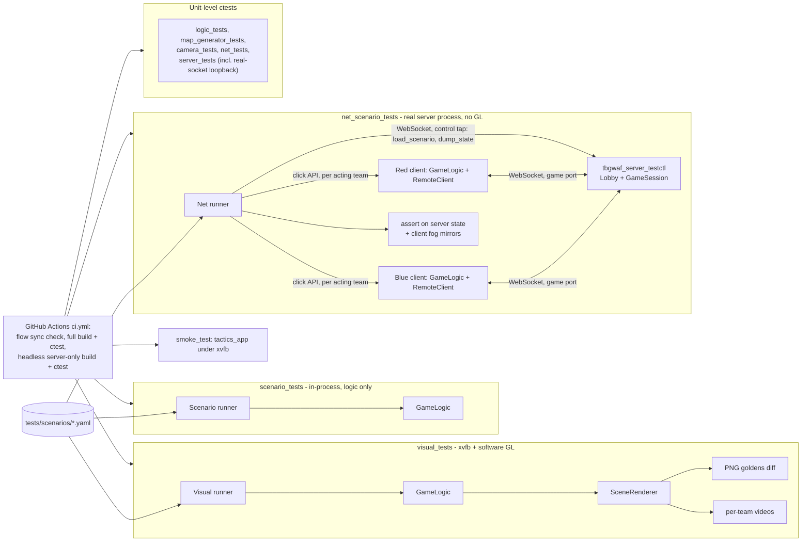
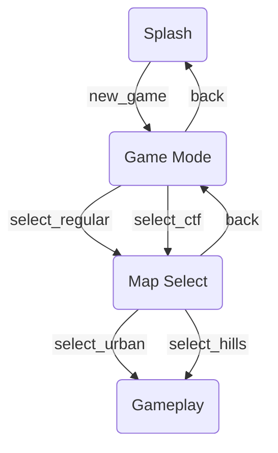

# tbgwaf

A turn-based tactics prototype: two 3-figure squads (Blue vs Red) fight on a
blocky obstacle field, each side fogged from the other's view, until one team
is eliminated.

**[Play it in your browser](https://thedeepestspace.github.io/tbgwaf/)** --
both players on one screen, no install required.

The page also includes **Blue vs Jev** and **Jev vs Jev** preview modes. They
use the same WASM game and require a server-side TypeSafe adapter; the API key
is never sent to the browser. See [Jev gameplay preview](docs/jev-preview.md)
for local setup, Pages/PR-preview URLs, deployment, limits, and smoke tests.

## Play in browser

The [live Pages build](https://thedeepestspace.github.io/tbgwaf/) is the same
native game compiled to WebAssembly/WebGL2. The page shows two canvases side
by side -- Blue on the left, Red on the right -- each with its own client
instance of the game (own camera, input, and UI); the WASM module is
instantiated once per canvas. Both teams plan at once: each instance sends
its own team's plans to the other over an in-page message bus, and Commit
Round (from either canvas) makes the Blue instance run the simulation and
broadcast it, which the Red instance mirrors. That in-page demo needs no
server; for real cross-device play see [Online play](#online-play-server)
below. See [Controls](#controls) below.

## Native build

```sh
cmake -B build -G Ninja -DCMAKE_BUILD_TYPE=Release
cmake --build build
ctest --test-dir build --output-on-failure
```

Run the game with `./build/tactics_app`. `ctest` also runs a headless
smoke test under `xvfb-run` if available.

Environment knobs: `TBGWAF_MAP_SEED=<n>` reseeds the procedural map.
The default map (also what the web build serves) is `urban-elevated`; the plain urban map lays an oblique boundary-to-boundary artery with
angled avenues/cross streets and polygon blocks whose buildings follow
their frontage; `TBGWAF_MAP=urban-merge` adds a wide branching avenue that
merges into the artery, `TBGWAF_MAP=urban-elevated` (default) turns the artery into a
true overpass (ramps up, crosses on pier bents with usable ground beneath,
ramps back down; the branch becomes an on-ramp merging mid-deck), and
`TBGWAF_MAP=hilly` selects rolling hills. Urban code/scenarios can also
tune artery count/width, local-street width/skew and elevation through
`MapGeneratorConfig` / `map.generate`. Press **N** in-game to toggle a debug
overlay of the navmesh's walkable-cell boundaries.

Urban maps carry pre-built **ziplines** (0-2 per block, seed-deterministic,
`MapGeneratorConfig::maxZiplinesPerBlock`): two-way cables between anchor
posts along the block sidewalks. A move plan may walk to one anchor, ride,
and walk on from the other; a ride costs `length * kZiplineCostFactor`
(0.25, in `game/Types.h`) of the figure's per-round move budget, so a longer
line spends more of the turn. The move frontier draws that reach as a second
(cyan) region with the line highlighted. One rider per line at a time (a
second rider waits at the anchor), and a rider can't shoot. Scenarios add
lines with `map.ziplines: [{from: [x,y,z], to: [x,y,z]}]` and assert an
out-of-reach move with `expect_unreachable: true`.
The app defaults to the prototype per-unit shadow-map FOV mask (tints
walls, roofs and deck sides too; see
[docs/fov-shadow-map.md](docs/fov-shadow-map.md)); `TBGWAF_FOV_SHADOW_MAP=0`
restores the analytic FOV-cone overlay. Visual scenarios still default to
the analytic overlay and opt in
with a `render: {fov_overlay: shadow_map}` block.

### Flag objective (CTF part 1)

A scene (or scenario YAML `flag:` block) can enable a neutral flag at the map
center (or the nearest free spot; `flag: {position: [x, z]}` overrides). A
living figure whose move passes through the flag's spot picks it up for free
and its team wins at once; `win_on_grab: false` instead just carries it
(stowed on the figure's back) while play continues. A carrier acts as normal;
if it dies the flag drops there and anyone passing picks it up. If several
figures reach it in the same tick the earliest arrival wins, with an exact tie
going to the lowest unit id. The flag is a neutral objective, so fog never
hides it (a carried one shows with its carrier). `round_limit: N` ends the
match as a draw after N rounds with no winner. Flag state travels in the
snapshot text protocol (`ExportState`/`ImportState`).

### Gameplay scenario tests

`tests/scenarios/*.yaml` are state-only (no rendering) gameplay regression
tests: each declares a map + starting units, then a scripted sequence of
player-equivalent actions (`move`/`shoot`/`pass`/`cancel`, driven through the
same click/choose API the interactive game uses) interleaved with
assertions on the resulting state (alive/dead, position, per-team FOV
visibility, round number, winner). They run as the
`scenario_tests` ctest target; see `tests/scenario/Scenario.h` for the full
field reference and `tests/scenarios/*.yaml` for examples.

### Visual regression tests

The same scenarios also run in an expensive *visual* mode (the
`visual_tests` ctest target, headless under `xvfb-run` like the smoke
test): for every turn of every scenario, both teams' fog-of-war panes are
rendered through the exact same `gfx::SceneRenderer` pass the app uses and
captured as one PNG per team per turn, then diffed against the checked-in
goldens under `tests/goldens/` with a pixelmatch-style tolerance
(per-channel threshold + max differing-pixel fraction, so driver/AA noise
doesn't fail the build but object-sized changes do).

When a visual change is *intentional*, regenerate and commit the goldens:

```sh
scripts/update_golden_baselines.sh
```

The runner (`build/tactics_visual_tests`) can also record a continuous
per-team video of each scenario with `--video` (requires `ffmpeg`); see
`--help` for the flags.

### Networked scenario tests

`net_scenario_tests` (`tests/net_scenario_tests.cpp`) replays the same YAML
scenarios through a **real `tbgwaf_server` process**, so the room, protocol,
serialization and fog-of-war paths are covered too. No GL; it runs headless
(also with `-DTBGWAF_BUILD_CLIENT=OFF`).

- The runner spawns `tbgwaf_server_testctl`: the server built with the
  loopback-only **control tap** (`--control-port`) compiled in. The shipped
  `tbgwaf_server` has no such flag. The tap speaks the same WebSocket framing as
  the game port and accepts `load_scenario` (scene + units, the same spec the
  YAML uses; clients receive it in `start`), `dump_state` (unfiltered server
  state) and `shutdown`.
- Per scenario it connects one headless client per team on the normal game port
  (`GameLogic` mirror + `net::RemoteClient` over a small native WebSocket client
  in `tests/net/`). Each scripted action runs through the **acting team's own
  mirror** (the same `ClickUnit`/`ChooseMove`/... calls as the in-process
  runner); `RemoteClient` ships the resulting plans, and a no-op `reaction` acts
  as a barrier so the next step starts after the server has applied them.
- Assertions run against the server's `dump_state` using the shared assertion
  code, plus checks that the server's fog matches a recomputation and that
  each client's mirror shows exactly what its team may see. Sighting-memory
  assertions run on the owning client's mirror (age 0 only; older ones are
  in-process only).
- All three runners advance rounds in the same fixed step
  (`constants::kSimStepSeconds`, 1/30 s), so reactions resolve identically.



### Weapons & the asset/animation gallery

Figures carry one of three procedural blocky weapons (issue #126), assigned
deterministically by unit id (`id % 3`): 0 = assault rifle, 1 = sniper
rifle, 2 = Desert Eagle — so every squad of three fields one of each. The
weapon sets the figure's animation class: rifles (AR + sniper) are carried
two-handed across the chest (both arms IK-solved onto the weapon, no arm
swing while running) and shoulder-aimed for shots; the Desert Eagle keeps
the one-handed low-ready carry and quick-draw shot. Weapons are visual
only — hit resolution is identical across them, though each weapon has its
own fire interval and bullet-scatter cone (every bullet of a burst flies its
own line).

Every weapon model and animation can be inspected on the **asset &
animation gallery**, a standalone page built alongside the game:
[live gallery](https://thedeepestspace.github.io/tbgwaf/gallery/) on Pages,
and `pr-preview/pr-<number>/gallery/` in each PR preview. The page lists
the three weapon turntables plus idle/run/shoot/empty-mag and downhill/uphill zipline rides per weapon — the
empty-mag clip dumps the whole magazine at the weapon's own fire interval,
each bullet leaving its own scattered tracer line (drag to orbit,
scroll to zoom, play/pause and scrub the loop). The catalog, framing, and
renderer live in `src/gallery/GalleryScene.*`, shared verbatim between the
web viewer (`src/gallery/gallery_main.cpp` + `web/gallery.html`) and a
native interactive build, `build/tactics_gallery_app` (left/right switch item, space pauses).

### PR scenario review page

Every pull request gets a **scenario review page** in its Pages preview:
per-team WebM videos of every scenario present at the PR's head, grouped by
how the PR changes each one (new/modified/unchanged, classified purely from
git metadata on the YAML files, not from screenshot diffs; deleted
scenarios are listed by name), generated by
`scripts/generate_scenario_review_page.py` and deployed to
`pr-preview/pr-<number>/scenarios/` by the same PR-preview workflow. The
workflow comments a direct link on the PR.

## Online play (server)

`tbgwaf_server` is a server-authoritative WebSocket backend: it pairs two
connections per room ("two sockets, one game"), holds the match in a headless
`tactics_logic` instance, and validates every action.

```sh
# Server only -- no SDL2/EGL/GLESv2 needed.
cmake -B build -G Ninja -DCMAKE_BUILD_TYPE=Release -DTBGWAF_BUILD_CLIENT=OFF
cmake --build build
./build/tbgwaf_server --port 8080     # PORT env var also works; GET /health -> 200
```

`-DTBGWAF_BUILD_CLIENT=OFF` skips the SDL2/GLES app and GL-based tests;
`-DTBGWAF_BUILD_SERVER=OFF` skips the server. Both default to ON.

**Local end-to-end test:** build the web client (below), serve the build dir,
and open it with a server URL (a bare port means `ws://localhost:<port>`):

```
http://localhost:8000/index.html?server=8080
```

With a server configured the page is split screen: the left and right panes
are two separate clients of the server, paired in a room private to the page
load, and the Human vs Human / Blue vs Jev / Jev vs Jev controls work as in the
local preview (the Jev side plans through the adapter and commits its own
team). Switching mode or Restart reloads into a fresh room. Known gap: the
server always plays its seed-driven map, so Jev vs Jev's capture-the-flag
default only applies to the no-server preview.

`?solo=1` shows a single pane instead, for two browsers: open
`index.html?server=ws://localhost:8080&solo=1&room=mygame` in both; the first
waits (Blue), the second is paired (Red). `?room=` picks the room (default for
`solo`: one shared room). Without `?server=` the page runs the in-page demo
(`?local=1` forces it). A default server can be baked in at build time:
`emcmake cmake -B build-web -DTBGWAF_SERVER_URL=wss://...` (the query parameter
still overrides it). An `https://` page can only reach `wss://` (or
`ws://localhost`).

**Protocol** (JSON text frames; full reference in `src/net/Protocol.h`).
Clients send discrete actions -- `move` (waypoint legs + facing), `shoot`,
`pass`, `cancel`, `focus`, `reaction`, `commit`, `new_match` --
each validated through the same click/choose flow the game and scenario
tests use. The server replies with rule state only: `ack`, the team's own
`plans`, `peer` readiness, and after each round a fog-filtered `round`
timeline (sampled positions, shot events, resulting state). Hidden enemy
figures and enemy plans are never sent, and no animation fields cross the
wire -- the client derives walk/shoot/fall animation locally. A round runs
once both teams have committed.

## Web (WASM) build

Requires the [Emscripten SDK](https://emscripten.io/docs/getting_started/downloads.html)
(already installed and on `PATH` in this repo's devcontainer):

```sh
emcmake cmake -B build-web -G Ninja -DCMAKE_BUILD_TYPE=Release
cmake --build build-web
```

This produces `build-web/tactics_app.{html,js,wasm}`. Serve the directory
with any static file server (e.g. `python3 -m http.server -d build-web`) and
open `tactics_app.html` -- it can't be opened as a `file://` URL, browsers
block WASM/fetch from local files. Pushes to `master` build and publish this
target to GitHub Pages automatically (`.github/workflows/pages.yml`).

Pull requests also get their own preview build, published to a per-PR
subdirectory (`pr-preview/pr-<number>/`) on the `gh-pages` branch
(`.github/workflows/pr-preview.yml`) without touching the production build.
The workflow comments on the PR with a link to the preview once it's ready,
and removes the preview automatically when the PR closes.

## App flow

Screen flow (Splash -> Game Mode -> Map Select -> Gameplay), declared in
`flow/app_flow.yaml`. The build regenerates `flow/app_flow.mmd` from it; paste
that file's contents below if the flow changes.



## Controls

- **Left click** one of your own figures (in your own viewport) to select
  it, then choose **Move**, **Shoot**, or **Pass** from the
  action menu.
  - Move: click a destination on the ground; the figure paths around
    obstacles via its navmesh. A move can only reach as far as the figure
    can run within one round's fixed execution window.
  - Shoot: click an enemy figure. Once the round executes, the shot fires
    the first instant the target is within your figure's forward-facing FOV
    cone with a clear line of sight -- including mid-round, if the target
    only walks into view while the round plays out. If that never happens
    before everything stops moving, the shot expires as a miss.
- **Right-click drag** to orbit the camera; **scroll** to zoom. Either side
  can freely look around its own viewport at any time.
- **Esc** cancels the current action/selection.

Rounds are simultaneous (WEGO): both teams plan every living figure
concurrently -- each viewport only accepts clicks for its own squad -- and a
single **Commit Round** then executes both sides' plans together, moves
animating concurrently and shots resolving continuously against live
FOV/line-of-sight. Two figures shooting each other in the same instant both
go down (wiping out both squads at once is a draw). Play continues round by
round until a team is eliminated.
